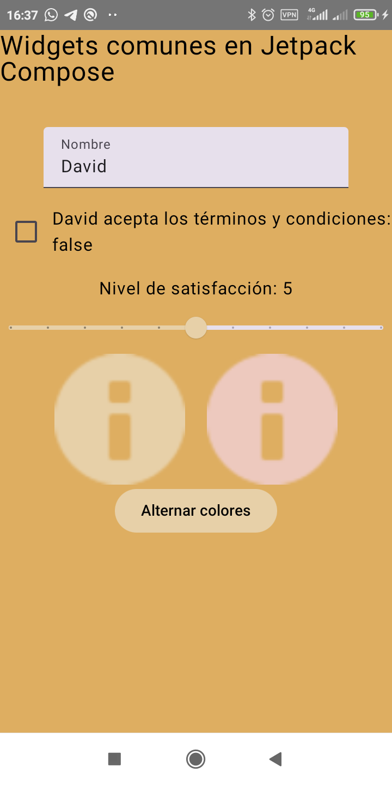
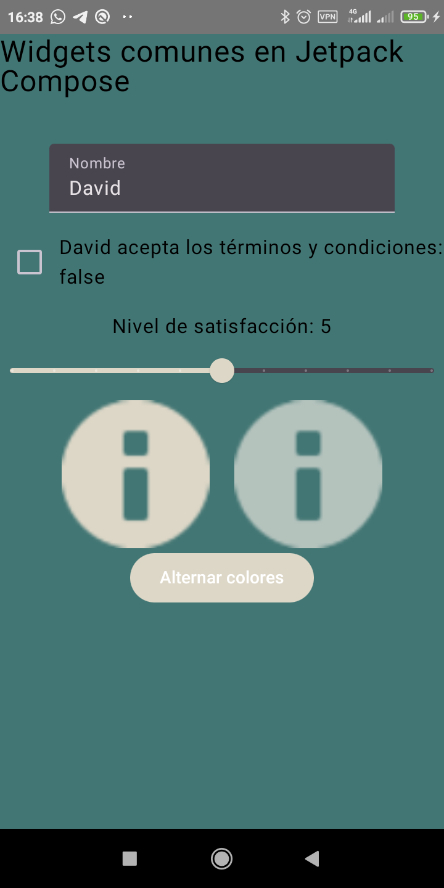

# UD2 Material3Theme
Esta aplicación en Jetpack Compose muestra el uso de widgets comunes, incluyendo un TextField, Checkbox, Slider, Button y Image. Además, implementa un tema personalizado con Material 3 que soporta tanto el modo claro como el oscuro.

    <figure>
        
        <figcaption>Vista de la aplicación</figcaption>
    </figure>
<figure>
        
        <figcaption>Vista de la aplicación</figcaption>
    </figure>

## Características
- TextField: Permite al usuario ingresar su nombre, que se muestra en otras secciones de la interfaz.
- Checkbox: Muestra si el usuario ha aceptado términos y condiciones. Actualiza el texto según el estado.
- Slider: Permite seleccionar un nivel de satisfacción, reflejando el valor en el texto.
- Button: Al presionarlo, alterna el color de los iconos de información entre dos colores del tema.
- Tema personalizado: Implementado con Material 3, adaptado tanto para tema claro como oscuro en colores personalizados

## Estructura del Proyecto
El archivo principal de la app es MainActivity.kt, que contiene los siguientes componentes:

- MainActivity: Actividad principal que aplica el tema WonderTheme y carga la interfaz de usuario.
- WidgetsDemo: Composable que implementa la interfaz con todos los widgets y maneja los estados correspondientes.

## Código Principal
El componente WidgetsDemo maneja estados para cada widget usando remember. Por ejemplo:

- name guarda el texto ingresado en el TextField.
- isChecked guarda el estado del Checkbox.
- sliderValue mantiene el valor seleccionado en el Slider.
- colored alterna el color de los iconos cuando el botón es presionado.